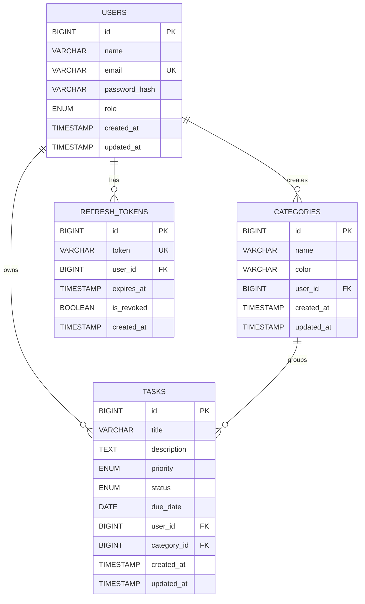

# ER Diagram – TaskFlow Task Management Application

## Overview

This ER diagram shows all database tables, their columns, data types, primary/foreign keys, and relationships for the TaskFlow application.

---

## ER Diagram

---

## Table Descriptions

### `USERS`
Stores registered user accounts.

| Column | Type | Constraints | Description |
|---|---|---|---|
| `id` | BIGINT | PK, AUTO_INCREMENT | Unique user identifier |
| `name` | VARCHAR(100) | NOT NULL | Full name of the user |
| `email` | VARCHAR(255) | NOT NULL, UNIQUE | Login email |
| `password_hash` | VARCHAR(255) | NOT NULL | Bcrypt hashed password |
| `role` | ENUM('USER','ADMIN') | DEFAULT 'USER' | User role |
| `created_at` | TIMESTAMP | NOT NULL | Record creation time |
| `updated_at` | TIMESTAMP | NOT NULL | Last update time |

---

### `CATEGORIES`
Stores task categories/projects created by users.

| Column | Type | Constraints | Description |
|---|---|---|---|
| `id` | BIGINT | PK, AUTO_INCREMENT | Unique category identifier |
| `name` | VARCHAR(100) | NOT NULL | Category name (e.g., "Work") |
| `color` | VARCHAR(20) | NULLABLE | Hex color code for UI |
| `user_id` | BIGINT | FK → USERS(id) | Owner of the category |
| `created_at` | TIMESTAMP | NOT NULL | Record creation time |
| `updated_at` | TIMESTAMP | NOT NULL | Last update time |

---

### `TASKS`
Stores individual tasks created by users.

| Column | Type | Constraints | Description |
|---|---|---|---|
| `id` | BIGINT | PK, AUTO_INCREMENT | Unique task identifier |
| `title` | VARCHAR(255) | NOT NULL | Task title |
| `description` | TEXT | NULLABLE | Detailed description |
| `priority` | ENUM('LOW','MEDIUM','HIGH') | DEFAULT 'MEDIUM' | Task priority level |
| `status` | ENUM('PENDING','IN_PROGRESS','DONE') | DEFAULT 'PENDING' | Current task status |
| `due_date` | DATE | NULLABLE | Deadline for the task |
| `user_id` | BIGINT | FK → USERS(id) | Owner of the task |
| `category_id` | BIGINT | FK → CATEGORIES(id) | Category the task belongs to |
| `created_at` | TIMESTAMP | NOT NULL | Record creation time |
| `updated_at` | TIMESTAMP | NOT NULL | Last update time |

---

### `REFRESH_TOKENS`
Stores JWT refresh tokens for session management.

| Column | Type | Constraints | Description |
|---|---|---|---|
| `id` | BIGINT | PK, AUTO_INCREMENT | Unique token record ID |
| `token` | VARCHAR(512) | NOT NULL, UNIQUE | The refresh token string |
| `user_id` | BIGINT | FK → USERS(id) | User who owns this token |
| `expires_at` | TIMESTAMP | NOT NULL | Token expiry time |
| `is_revoked` | BOOLEAN | DEFAULT FALSE | Whether token is revoked |
| `created_at` | TIMESTAMP | NOT NULL | Record creation time |

---

## Relationships Summary

| Relationship | Type | Description |
|---|---|---|
| `USERS` → `TASKS` | One-to-Many | A user can have many tasks |
| `USERS` → `CATEGORIES` | One-to-Many | A user can create many categories |
| `CATEGORIES` → `TASKS` | One-to-Many | A category can contain many tasks |
| `USERS` → `REFRESH_TOKENS` | One-to-Many | A user can have multiple refresh tokens |

---

## Notes

- **Cascade Delete:** When a `USER` is deleted, all their `TASKS`, `CATEGORIES`, and `REFRESH_TOKENS` are deleted (ON DELETE CASCADE).
- **Nullable FK:** `category_id` in `TASKS` is nullable — a task can exist without a category.
- **Soft Delete (optional):** A `deleted_at` column can be added to `TASKS` and `USERS` for soft deletion in future milestones.
