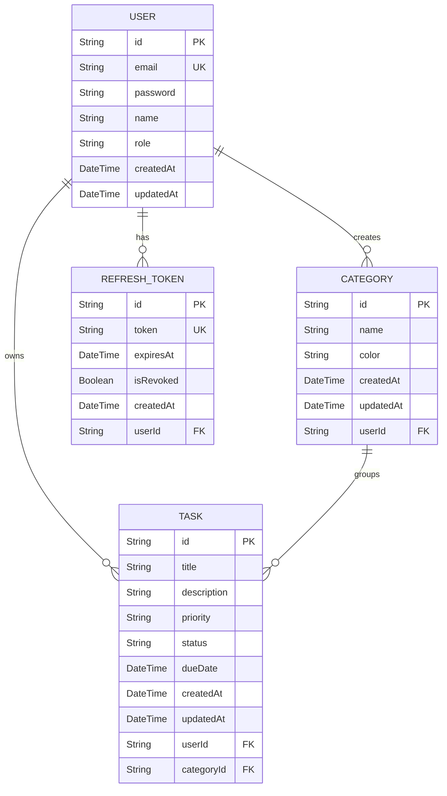

# Entity-Relationship Diagram (ERD)

```mermaid
erDiagram
    USER {
        String id PK
        String email UK
        String password
        String name
        String role
        DateTime createdAt
        DateTime updatedAt
    }

    TASK {
        String id PK
        String title
        String description
        String priority
        String status
        DateTime dueDate
        DateTime createdAt
        DateTime updatedAt
        String userId FK
        String categoryId FK
    }

    CATEGORY {
        String id PK
        String name
        String color
        DateTime createdAt
        DateTime updatedAt
        String userId FK
    }

    REFRESH_TOKEN {
        String id PK
        String token UK
        DateTime expiresAt
        Boolean isRevoked
        DateTime createdAt
        String userId FK
    }

    USER ||--o{ TASK : "owns"
    USER ||--o{ CATEGORY : "creates"
    USER ||--o{ REFRESH_TOKEN : "has"
    CATEGORY ||--o{ TASK : "groups"
```
