# Class Diagram – TaskFlow Task Management Application

## Overview

The class diagram shows the major classes, their attributes, methods, and relationships in the TaskFlow backend system. It follows OOP principles: encapsulation, abstraction, inheritance, and polymorphism.

---

## Class Diagram

```mermaid
classDiagram

    %% ─── Base Entity ───
    class BaseEntity {
        <<abstract>>
        +Long id
        +LocalDateTime createdAt
        +LocalDateTime updatedAt
    }

    %% ─── User ───
    class User {
        +String name
        +String email
        +String passwordHash
        +Role role
        +List~Task~ tasks
        +List~Category~ categories
        +getUserTasks() List~Task~
        +getCategories() List~Category~
    }

    %% ─── Role Enum ───
    class Role {
        <<enumeration>>
        USER
        ADMIN
    }

    %% ─── Task ───
    class Task {
        +String title
        +String description
        +Priority priority
        +TaskStatus status
        +LocalDate dueDate
        +User owner
        +Category category
        +markComplete() void
        +isOverdue() boolean
        +updateDetails(title, description, priority, dueDate) void
    }

    %% ─── Priority Enum ───
    class Priority {
        <<enumeration>>
        LOW
        MEDIUM
        HIGH
    }

    %% ─── TaskStatus Enum ───
    class TaskStatus {
        <<enumeration>>
        PENDING
        IN_PROGRESS
        DONE
    }

    %% ─── Category ───
    class Category {
        +String name
        +String color
        +User owner
        +List~Task~ tasks
        +addTask(task) void
        +removeTask(task) void
    }

    %% ─── Repositories (Interfaces) ───
    class TaskRepository {
        <<interface>>
        +save(task Task) Task
        +findById(id Long) Optional~Task~
        +findByUserId(userId Long) List~Task~
        +findByUserIdAndFilters(userId Long, filters FilterDTO) List~Task~
        +updateStatus(id Long, status TaskStatus) void
        +delete(id Long) void
    }

    class UserRepository {
        <<interface>>
        +save(user User) User
        +findById(id Long) Optional~User~
        +findByEmail(email String) Optional~User~
        +delete(id Long) void
    }

    class CategoryRepository {
        <<interface>>
        +save(category Category) Category
        +findByUserId(userId Long) List~Category~
        +findById(id Long) Optional~Category~
        +delete(id Long) void
    }

    %% ─── Services ───
    class TaskService {
        -TaskRepository taskRepository
        -CategoryRepository categoryRepository
        +createTask(userId Long, dto TaskDTO) TaskDTO
        +getTasksByUser(userId Long, filters FilterDTO) List~TaskDTO~
        +updateTask(taskId Long, userId Long, dto TaskDTO) TaskDTO
        +deleteTask(taskId Long, userId Long) void
        +markTaskComplete(taskId Long, userId Long) TaskDTO
    }

    class AuthService {
        -UserRepository userRepository
        -PasswordEncoder passwordEncoder
        -JwtUtil jwtUtil
        +register(dto RegisterDTO) void
        +login(dto LoginDTO) String
        +validateToken(token String) UserDetails
    }

    class CategoryService {
        -CategoryRepository categoryRepository
        +createCategory(userId Long, dto CategoryDTO) CategoryDTO
        +getCategoriesByUser(userId Long) List~CategoryDTO~
        +deleteCategory(categoryId Long, userId Long) void
    }

    %% ─── Controllers ───
    class TaskController {
        -TaskService taskService
        +createTask(request) ResponseEntity
        +getTasks(request, filters) ResponseEntity
        +updateTask(id, request) ResponseEntity
        +deleteTask(id, request) ResponseEntity
        +markComplete(id, request) ResponseEntity
    }

    class AuthController {
        -AuthService authService
        +register(dto RegisterDTO) ResponseEntity
        +login(dto LoginDTO) ResponseEntity
    }

    class CategoryController {
        -CategoryService categoryService
        +createCategory(request) ResponseEntity
        +getCategories(request) ResponseEntity
        +deleteCategory(id, request) ResponseEntity
    }

    %% ─── Filter Strategy (Strategy Pattern) ───
    class FilterStrategy {
        <<interface>>
        +apply(tasks List~Task~) List~Task~
    }

    class PriorityFilterStrategy {
        -Priority priority
        +apply(tasks List~Task~) List~Task~
    }

    class StatusFilterStrategy {
        -TaskStatus status
        +apply(tasks List~Task~) List~Task~
    }

    class DueDateFilterStrategy {
        -LocalDate dueDate
        +apply(tasks List~Task~) List~Task~
    }

    %% ─── Relationships ───

    BaseEntity <|-- User : extends
    BaseEntity <|-- Task : extends
    BaseEntity <|-- Category : extends

    User "1" --> "many" Task : owns
    User "1" --> "many" Category : owns
    Task "many" --> "1" Category : belongs to
    User --> Role : has

    Task --> Priority : has
    Task --> TaskStatus : has

    TaskController --> TaskService : uses
    AuthController --> AuthService : uses
    CategoryController --> CategoryService : uses

    TaskService --> TaskRepository : uses
    TaskService --> CategoryRepository : uses
    AuthService --> UserRepository : uses
    CategoryService --> CategoryRepository : uses

    FilterStrategy <|.. PriorityFilterStrategy : implements
    FilterStrategy <|.. StatusFilterStrategy : implements
    FilterStrategy <|.. DueDateFilterStrategy : implements

    TaskService --> FilterStrategy : uses
```

---

## Design Patterns Used

| Pattern | Where Used | Why |
|---|---|---|
| **Repository Pattern** | `TaskRepository`, `UserRepository`, `CategoryRepository` | Abstracts data access from business logic |
| **Service Layer** | `TaskService`, `AuthService`, `CategoryService` | Separates business logic from controllers |
| **Strategy Pattern** | `FilterStrategy` and its implementations | Allows flexible, interchangeable filtering logic |
| **DTO Pattern** | `TaskDTO`, `RegisterDTO`, `LoginDTO` | Decouples API layer from internal models |

---

## OOP Principles

| Principle | Applied In |
|---|---|
| **Encapsulation** | All fields in `User`, `Task`, `Category` are private with getters/setters |
| **Abstraction** | Repository interfaces abstract DB operations; Service interfaces abstract business logic |
| **Inheritance** | `User`, `Task`, `Category` all extend `BaseEntity` |
| **Polymorphism** | `FilterStrategy` interface allows different filter implementations to be used interchangeably |
