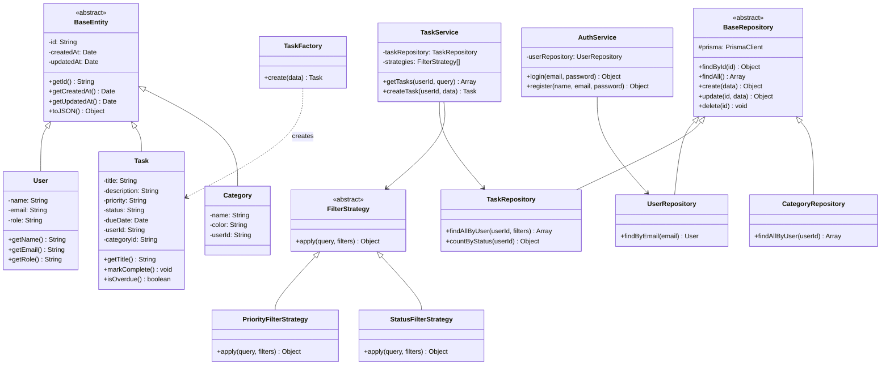

# Class Diagram

```mermaid
classDiagram
    %% Base Classes & Abstractions
    class BaseEntity {
        <<abstract>>
        -id: String
        -createdAt: Date
        -updatedAt: Date
        +getId() String
        +getCreatedAt() Date
        +getUpdatedAt() Date
        +toJSON() Object
    }

    class BaseRepository {
        <<abstract>>
        #prisma: PrismaClient
        +findById(id) Object
        +findAll() Array
        +create(data) Object
        +update(id, data) Object
        +delete(id) void
    }

    class FilterStrategy {
        <<abstract>>
        +apply(query, filters) Object
    }

    %% Domain Models
    class User {
        -name: String
        -email: String
        -role: String
        +getName() String
        +getEmail() String
        +getRole() String
    }
    BaseEntity <|-- User

    class Task {
        -title: String
        -description: String
        -priority: String
        -status: String
        -dueDate: Date
        -userId: String
        -categoryId: String
        +getTitle() String
        +markComplete() void
        +isOverdue() boolean
    }
    BaseEntity <|-- Task

    class Category {
        -name: String
        -color: String
        -userId: String
    }
    BaseEntity <|-- Category

    %% Repositories
    class UserRepository {
        +findByEmail(email) User
    }
    BaseRepository <|-- UserRepository

    class TaskRepository {
        +findAllByUser(userId, filters) Array
        +countByStatus(userId) Object
    }
    BaseRepository <|-- TaskRepository

    class CategoryRepository {
        +findAllByUser(userId) Array
    }
    BaseRepository <|-- CategoryRepository

    %% Strategies
    class PriorityFilterStrategy {
        +apply(query, filters) Object
    }
    FilterStrategy <|-- PriorityFilterStrategy

    class StatusFilterStrategy {
        +apply(query, filters) Object
    }
    FilterStrategy <|-- StatusFilterStrategy

    %% Services
    class TaskService {
        -taskRepository: TaskRepository
        -strategies: FilterStrategy[]
        +getTasks(userId, query) Array
        +createTask(userId, data) Task
    }
    TaskService --> TaskRepository
    TaskService --> FilterStrategy

    class AuthService {
        -userRepository: UserRepository
        +login(email, password) Object
        +register(name, email, password) Object
    }
    AuthService --> UserRepository

    %% Factories
    class TaskFactory {
        +create(data) Task
    }
    TaskFactory ..> Task : creates
```
