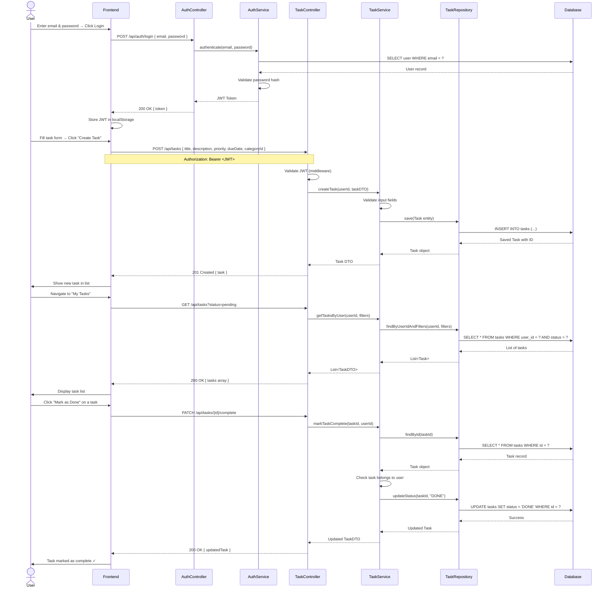

# Sequence Diagram – TaskFlow Task Management Application

## Main Flow: User Creates and Manages a Task (End-to-End)

This sequence diagram shows the complete flow from user login to creating a task, viewing tasks, and marking one as complete.

---

---

## Flow Summary

| Step | Description |
|---|---|
| **1. Login** | User authenticates; receives JWT token |
| **2. Create Task** | JWT is validated; task is saved to DB via Service → Repository |
| **3. View Tasks** | Tasks are fetched with optional filters |
| **4. Mark Complete** | Task ownership is verified; status updated to DONE |

---

## Notes

- **JWT Middleware** validates every protected request before it reaches the controller.
- **TaskService** contains all business logic (validation, ownership checks).
- **TaskRepository** is the only layer that directly interacts with the database.
- This follows the **Layered Architecture** pattern strictly.
