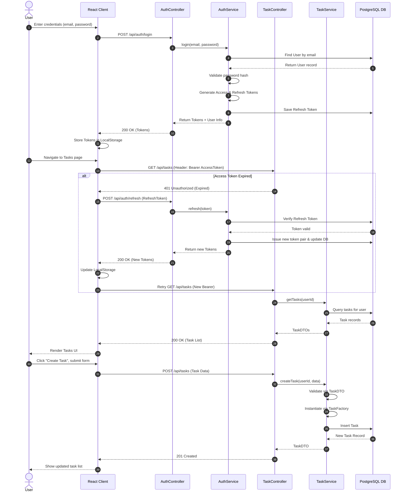

# Sequence Diagram: Main Flow End-to-End

This diagram outlines the core flow of a user logging in, requesting tasks (with a token refresh happening seamlessly), and creating a new task.

```mermaid
sequenceDiagram
    autonumber
    actor User
    participant Frontend as React Client
    participant AuthController
    participant AuthService
    participant TaskController
    participant TaskService
    participant Database as PostgreSQL DB

    User->>Frontend: Enter credentials (email, password)
    Frontend->>AuthController: POST /api/auth/login
    AuthController->>AuthService: login(email, password)
    AuthService->>Database: Find User by email
    Database-->>AuthService: Return User record
    AuthService->>AuthService: Validate password hash
    AuthService->>AuthService: Generate Access & Refresh Tokens
    AuthService->>Database: Save Refresh Token
    AuthService-->>AuthController: Return Tokens + User Info
    AuthController-->>Frontend: 200 OK (Tokens)
    
    Frontend->>Frontend: Store Tokens in LocalStorage
    
    User->>Frontend: Navigate to Tasks page
    Frontend->>TaskController: GET /api/tasks (Header: Bearer AccessToken)
    
    alt Access Token Expired
        TaskController-->>Frontend: 401 Unauthorized (Expired)
        Frontend->>AuthController: POST /api/auth/refresh (RefreshToken)
        AuthController->>AuthService: refresh(token)
        AuthService->>Database: Verify Refresh Token
        Database-->>AuthService: Token valid
        AuthService->>Database: Issue new token pair & update DB
        AuthService-->>AuthController: Return new Tokens
        AuthController-->>Frontend: 200 OK (New Tokens)
        Frontend->>Frontend: Update LocalStorage
        Frontend->>TaskController: Retry GET /api/tasks (New Bearer)
    end
    
    TaskController->>TaskService: getTasks(userId)
    TaskService->>Database: Query tasks for user
    Database-->>TaskService: Task records
    TaskService-->>TaskController: TaskDTOs
    TaskController-->>Frontend: 200 OK (Task List)
    Frontend-->>User: Render Tasks UI
    
    User->>Frontend: Click "Create Task", submit form
    Frontend->>TaskController: POST /api/tasks (Task Data)
    TaskController->>TaskService: createTask(userId, data)
    TaskService->>TaskService: Validate via TaskDTO
    TaskService->>TaskService: Instantiate via TaskFactory
    TaskService->>Database: Insert Task
    Database-->>TaskService: New Task Record
    TaskService-->>TaskController: TaskDTO
    TaskController-->>Frontend: 201 Created
    Frontend-->>User: Show updated task list
```
