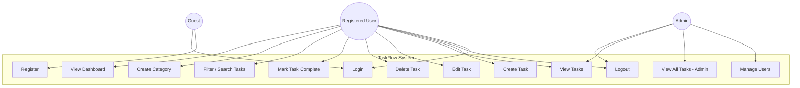

# Use Case Diagram – TaskFlow Task Management Application

## Actors

| Actor | Description |
|---|---|
| **Guest** | Unauthenticated user visiting the app |
| **Registered User** | Authenticated user who can manage tasks |
| **Admin** | Super user who can manage all users and data |

---

## Use Case Diagram

---

## Use Case Descriptions

### UC1 – Register
- **Actor:** Guest
- **Description:** A new user creates an account by providing name, email, and password.
- **Precondition:** User is not logged in.
- **Postcondition:** Account is created; user can now log in.

---

### UC2 – Login
- **Actor:** Guest, Registered User
- **Description:** User authenticates with email and password. A JWT token is returned.
- **Precondition:** User has a registered account.
- **Postcondition:** User is authenticated and can access protected routes.

---

### UC3 – Logout
- **Actor:** Registered User, Admin
- **Description:** User ends their session; JWT token is invalidated on client side.
- **Precondition:** User is logged in.
- **Postcondition:** User is logged out.

---

### UC4 – Create Task
- **Actor:** Registered User
- **Description:** User creates a new task with title, description, priority, due date, and category.
- **Precondition:** User is authenticated.
- **Postcondition:** Task is saved in the database.

---

### UC5 – View Tasks
- **Actor:** Registered User, Admin
- **Description:** User views their list of tasks. Admin can view all tasks.
- **Precondition:** User is authenticated.
- **Postcondition:** Task list is displayed.

---

### UC6 – Edit Task
- **Actor:** Registered User
- **Description:** User updates task details (title, description, priority, due date, status).
- **Precondition:** Task exists and belongs to the user.
- **Postcondition:** Task is updated in the database.

---

### UC7 – Delete Task
- **Actor:** Registered User
- **Description:** User permanently removes a task.
- **Precondition:** Task exists and belongs to the user.
- **Postcondition:** Task is deleted from the database.

---

### UC8 – Mark Task Complete
- **Actor:** Registered User
- **Description:** User toggles a task's status to "Done".
- **Precondition:** Task exists and is not already completed.
- **Postcondition:** Task status is updated to "Done".

---

### UC9 – Filter / Search Tasks
- **Actor:** Registered User
- **Description:** User filters tasks by status, priority, or due date, or searches by title keyword.
- **Precondition:** User is authenticated.
- **Postcondition:** Filtered/searched task list is displayed.

---

### UC10 – Create Category
- **Actor:** Registered User
- **Description:** User creates a category (e.g., "Work", "Personal") to group tasks.
- **Precondition:** User is authenticated.
- **Postcondition:** Category is saved and available for task assignment.

---

### UC11 – View Dashboard
- **Actor:** Registered User
- **Description:** User sees a summary: total tasks, completed, pending, overdue.
- **Precondition:** User is authenticated.
- **Postcondition:** Dashboard statistics are displayed.

---

### UC12 – Manage Users (Admin)
- **Actor:** Admin
- **Description:** Admin can view, deactivate, or delete user accounts.
- **Precondition:** Admin is authenticated.
- **Postcondition:** User account is updated or removed.

---

### UC13 – View All Tasks (Admin)
- **Actor:** Admin
- **Description:** Admin can view tasks of all users for moderation.
- **Precondition:** Admin is authenticated.
- **Postcondition:** All tasks are displayed.
