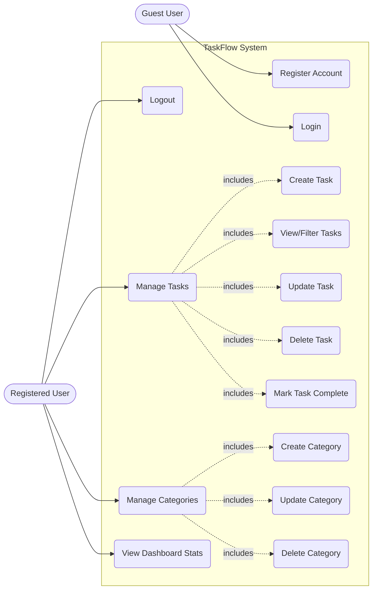

# Use Case Diagram

```mermaid
flowchart LR
    %% Actors
    User([Registered User])
    Guest([Guest User])

    %% System Boundary
    subgraph TaskFlow["TaskFlow System"]
        direction TB
        
        UC1(Register Account)
        UC2(Login)
        UC3(Logout)
        
        UC4(Manage Tasks)
        UC4a(Create Task)
        UC4b(View/Filter Tasks)
        UC4c(Update Task)
        UC4d(Delete Task)
        UC4e(Mark Task Complete)
        
        UC5(Manage Categories)
        UC5a(Create Category)
        UC5b(Update Category)
        UC5c(Delete Category)
        
        UC6(View Dashboard Stats)
    end

    %% Guest Relationships
    Guest --> UC1
    Guest --> UC2

    %% User Relationships
    User --> UC3
    User --> UC4
    User --> UC5
    User --> UC6

    %% Includes
    UC4 -.->|includes| UC4a
    UC4 -.->|includes| UC4b
    UC4 -.->|includes| UC4c
    UC4 -.->|includes| UC4d
    UC4 -.->|includes| UC4e

    UC5 -.->|includes| UC5a
    UC5 -.->|includes| UC5b
    UC5 -.->|includes| UC5c
```
